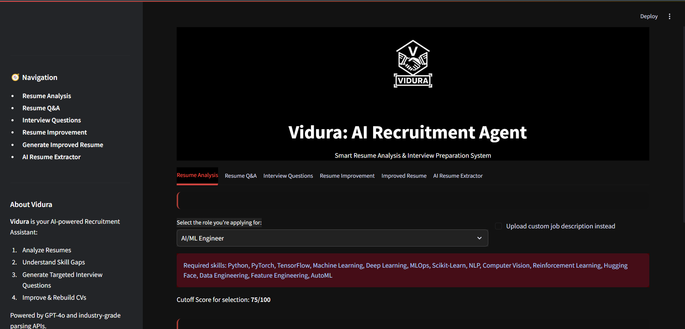

# Vidura: AI Recruitment Agent

Vidura is an intelligent recruitment assistant designed to automate and enhance resume analysis, interview preparation, and candidate evaluation using AI/ML techniques and real-time resume parsing APIs.

---




## Features

- **AI Resume Parsing** using SharpAPI (via MagicAPI)
- **Candidate Q&A** using GPT-4o
- **Interview Question Generator** (Behavioral, Technical, Coding, etc.)
- **Resume Analyzer** with Strengths, Gaps, and Scorecard
- **Resume Improvement Suggestions** based on job role
- **Generate Improved Resume** based on JD and role
- **Exportable Analysis & Interview Questions**
- **Modern UI with Dark Theme and Branding**

---

## Tech Stack

- **Frontend/UI**: Streamlit (Custom Themed)
- **Backend Logic**: Python
- **AI Models**: OpenAI GPT-4o
- **Resume Parsing API**: SharpAPI (via MagicAPI)
- **Environment Management**: `dotenv` + `.streamlit/secrets.toml`

---

## ⚙️ Setup Instructions

### 1. Clone the repo
```bash
git clone https://github.com/your-username/Vidura-AI-Recruitment-Agent.git
cd Vidura-AI-Recruitment-Agent
```
### 2. Create and activate virtual environment (optional but recommended)
```bash
python -m venv venv
source venv/bin/activate  # or venv\Scripts\activate for Windows
```
### 3. Install dependencies
```bash
pip install -r requirements.txt
```
### 4. Configure API Keys
.env File
```bash
API_KEY=your_api_key_here
```
.streamlit/secrets.toml
```bash
magic_api_key = "your_magicapi_key_here"
```

## ▶️ Running the app
```bash
streamlit run app.py
```


## Developed By
Team KantaBai ❤️
Members:
- Gautam Kumar
- Aman Rout
- Shiva Tiwari
- Rounit Singh


